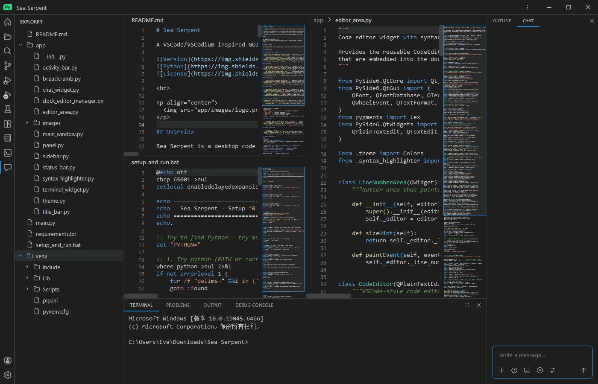

# Sea Serpent

A VSCode/VSCodium-inspired GUI Desktop Client built with **PySide6** (Qt for Python).


<br>

<p align="center">
  
</p>

## Overview

Sea Serpent is a desktop code editor that faithfully reproduces the Visual Studio Code user interface and interaction patterns. It is built entirely in Python using PySide6 (the official Qt for Python bindings), with zero external JavaScript or Electron dependencies.

## Features

### Window & Layout

- **Custom frameless title bar** with native window controls (minimize, maximize/restore, close), menu bar, tab dropdown, and drag-to-move
- **Activity bar** — icon-based view switching: Explorer, Search, Source Control, Run & Debug, Extensions, Terminal, and AI Agent
- **Collapsible sidebar** — file explorer tree with multi-view stacked pages
- **Right sidebar** — Copilot-style AI chat panel, toggleable via menu or Ctrl+Shift+R
- **Flexible splitter layout** — resizable sidebars and bottom panel with draggable splitter handles
- **Manual maximize/restore** — reliable geometry-based implementation for frameless windows

### Editor

- **Dock-based multi-tab editor** — powered by PySide6-QtAds; each file lives in its own dock widget
- **Drag-to-float** — drag a file tab out to float it as a separate window; re-dock to restore
- **Syntax highlighting** — via Pygments, supporting Python, JavaScript, TypeScript, HTML, CSS, JSON, C/C++, Rust, Go, Java, Ruby, Shell, YAML, XML, Markdown, and many more
- **Syntax-aware minimap** — scrollable code overview on the right side of each editor
- **Breadcrumb navigation bar** — clickable path segments (e.g. `src > app > main_window.py`) above each editor
- **Whitespace rendering** — toggle visibility of spaces and tabs
- **5 MB file size limit** — large files open with truncation and a warning notice
- **Welcome page** — shown when no files are open

### Terminal

- **Real interactive terminal** — spawns `cmd.exe` on Windows or `bash`/`$SHELL` on Unix via QProcess
- **ANSI escape code support** — full 3/4-bit, 8-bit (256-color), bold, and SGR reset parsing
- **Read-only output protection** — process output is append-only; user can only type in the input zone
- **Ctrl+C support** — sends `\x03` (SIGINT) to the running shell process

### AI Chat

- **Copilot-style chat panel** — located in the right sidebar, activated via the Agent icon in the activity bar
- **Conversation view** — role-labeled chat bubbles (You / Copilot) with auto-scroll
- **Rich input area** — auto-resizing text input, Enter to send, Shift+Enter for newline
- **Context chips** — pill-shaped attachment indicators for files/folders (pluggable)
- **Toolbar buttons** — Add, Agent, New Chat, Chat History, Settings
- **Demo response simulation** — modular backend-ready design, easy to wire up to a real LLM API

### Panel & Status

- **Bottom panel** — Terminal, Problems (with sample diagnostics), Output, Debug Console
- **Panel maximize/restore** — toggle the panel to fill the full window height
- **Status bar** — left section (branch icon) and right section (errors/warnings, encoding, language mode, line/column)

### Commands & Shortcuts

| Shortcut | Action |
|---|---|
| `Ctrl+Shift+P` / `F1` | Command Palette |
| `Ctrl+B` | Toggle Sidebar |
| `Ctrl+J` | Toggle Bottom Panel |
| `Ctrl+W` | Close Current Tab |
| Menu → View | Toggle Minimap, Toggle Right Sidebar, Toggle Whitespace, Toggle Activity Bar Size |

### Theming

- **VSCode Dark+ (Default Dark) theme** — faithful reproduction of color values sourced from the VS Code source
- **Fusion style** — Qt's cross-platform Fusion style as the base widget style
- **High-DPI support** — `PassThrough` rounding policy for crisp rendering on retina displays
- **Custom QSS stylesheets** — comprehensive dark theme covering all widgets (menus, tooltips, scrollbars, trees, inputs, tabs)

## Requirements

- **Python** 3.9+
- **PySide6** ≥ 6.5.0 — Qt for Python bindings
- **PySide6-QtAds** ≥ 4.4.0 — dock-based window management
- **Pygments** ≥ 2.15.0 — syntax highlighting engine

## Installation

```bash
# Clone the repository
git clone https://github.com/Bastionsearea/sea-serpent.git
cd sea-serpent

# Create a virtual environment (recommended)
python -m venv venv
source venv/bin/activate   # Linux/macOS
# venv\Scripts\activate    # Windows

# Install dependencies
pip install -r requirements.txt
```

## Usage

```bash
python main.py
```

On launch, the window opens at 1400×900 centered on the primary screen. Use the **Explorer** in the activity bar to browse and open files, or drag-and-drop files onto the editor area.

## Project Structure

```
Sea Serpent/
├── main.py                       # Application entry point
├── requirements.txt              # Python dependencies
├── README.md                     # This file
├── app/
│   ├── __init__.py               # Package init
│   ├── theme.py                  # Colors, SVG icons, global QSS stylesheet
│   ├── title_bar.py              # Custom frameless title bar with menus & tab dropdown
│   ├── activity_bar.py           # Left-side icon navigation strip
│   ├── sidebar.py                # Collapsible sidebar with file explorer tree
│   ├── editor_area.py            # Code editor widget & integrated minimap
│   ├── dock_editor_manager.py    # Dock-based multi-tab editor manager (PySide6-QtAds)
│   ├── breadcrumb.py             # VS Code-style breadcrumb navigation bar
│   ├── syntax_highlighter.py     # Pygments-based syntax highlighting (QSyntaxHighlighter)
│   ├── chat_widget.py            # Copilot-style AI chat panel with conversation UI
│   ├── terminal_widget.py        # Real interactive terminal (QProcess + ANSI parser)
│   ├── status_bar.py             # Bottom status bar (branch, errors, encoding, position)
│   ├── panel.py                  # Bottom panel (Terminal, Problems, Output, Debug Console)
│   ├── main_window.py            # Main window assembling all components
│   └── images/
│       └── logo.png              # Application logo
└── venv/                         # Virtual environment (not tracked)
```

## Design Reference

The UI design mirrors **VSCodium** (the open-source, telemetry-free fork of VSCode). The color palette, layout proportions, and interaction patterns follow VSCode's Dark+ theme and default UI layout. CSS class names in the chat widget comments reference the actual VS Code source structure (`microsoft/vscode`).

## Architecture

Sea Serpent follows a component-based architecture where each UI piece is a self-contained PySide6 widget:

- **`main_window.py`** is the central orchestrator — it creates all components, wires signals/slots, manages layout splitters, and handles global keyboard shortcuts
- **`dock_editor_manager.py`** manages the editor lifecycle: open, close, switch, float/re-dock via PySide6-QtAds
- **`theme.py`** is the single source of truth for all colors, SVG icons, and the global QSS stylesheet — every other component imports from it
- **`terminal_widget.py`** is a real PTY-backed terminal with a custom ANSI sequence parser — no external terminal emulator library required
- **`chat_widget.py`** is designed to be backend-agnostic — swap in a real LLM API by replacing the `_simulate_response` method

## Roadmap

- [ ] Real LLM backend integration for the chat panel (Anthropic / OpenAI API)
- [ ] File system watcher for live explorer updates
- [ ] Git integration (Source Control view)
- [ ] Extension system
- [ ] Search & Replace across files
- [ ] Debug adapter protocol support
- [ ] Settings editor UI
- [ ] macOS `.app` bundle packaging

## License

MIT
